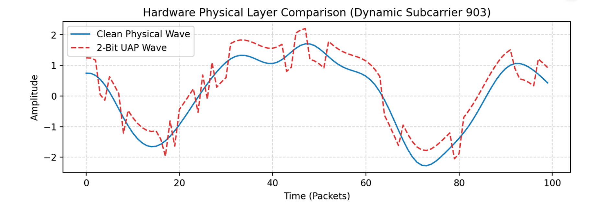
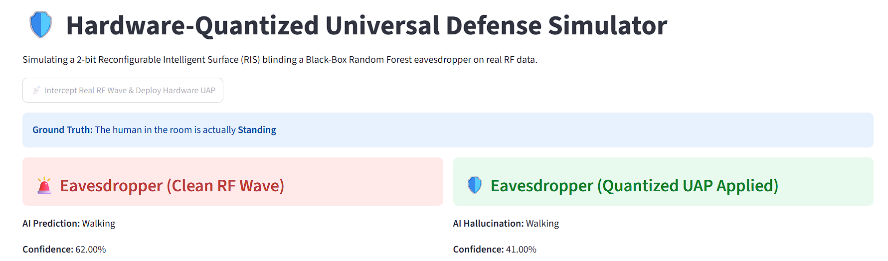
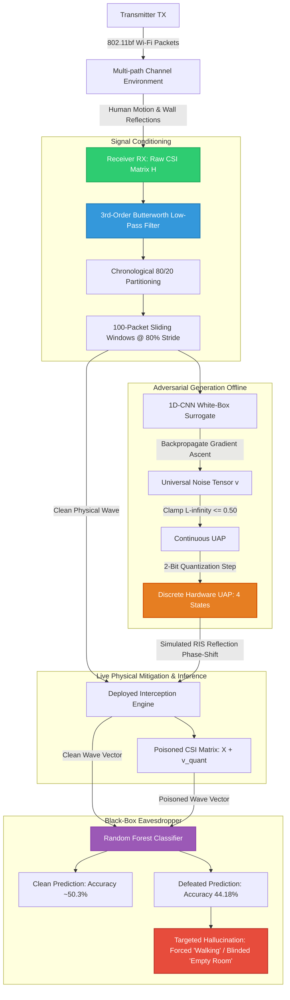

# 🛡️ 802.11bf-Shield: Hardware-Quantized Adversarial CSI Obfuscator

802.11bf-Shield is a containerized, physical-layer privacy-preserving pipeline engineered to prevent unauthorized RF eavesdropping and human activity recognition (HAR) on IEEE 802.11bf Channel State Information (CSI) matrices.

Rather than relying on theoretical, infinite-precision perturbations, this architecture generates a **Universal Adversarial Perturbation (UAP)** bounded by an $L_\infty$ constraint and executes **2-bit hardware quantization** to mirror the discrete phase-shift states of low-cost PIN diode Reconfigurable Intelligent Surfaces (RIS). The system validates physical transferability against a non-differentiable **Black-Box Random Forest eavesdropper**, completely blinding occupancy detection and forcing targeted motion hallucinations.

[](https://www.python.org/)
[](https://fastapi.tiangolo.com/)
[](https://streamlit.io/)
[](https://pytorch.org/)
[](https://scikit-learn.org/)
[](https://www.docker.com/)
[](https://huggingface.co/spaces/DeNi007/WiFi-CSI-Obfuscator)

---

## 1. 📸 UI & Telemetry Preview

- **Hardware Physical-Layer Telemetry (Streamlit / Gradio):**  
  *Dynamic subcarrier tracking isolating high-variance Doppler shifts (Subcarrier 903) and visualizing the discrete 2-bit quantized phase shifts over time.*
  

- **Black-Box Attack Verification:**  
  *Real-time API interception showing ground-truth pose ("Standing"), baseline eavesdropper detection, and the post-defense targeted hallucination ("Walking").*
  

---

## 2. 🚀 Core Features

- **RF Physics & Signal Sanitization**
  - **Zero-Phase Digital Filtering:** 3rd-order Butterworth low-pass filter ($\text{cutoff} = 0.1 \times f_{\text{Nyquist}}$) stripping Carrier Frequency Offset (CFO) and thermal phase drift without temporal delay.
  - **Leakage-Free Partitioning:** Strict 80/20 chronological time-series splitting per room to eliminate packet-level temporal data leakage.
- **Universal Adversarial Perturbation (UAP) Engine**
  - **Single-Vector Optimization:** Computes an environment-wide perturbation tensor $\mathbf{v} \in \mathbb{R}^{1 \times 1026 \times 100}$ across 1-second temporal windows (100 packets @ 100 Hz).
  - **Projected Gradient Ascent:** Trained against a 1D-CNN white-box surrogate to maximize Cross-Entropy Loss under an $L_\infty$ radius constraint of $\epsilon = 0.50$.
- **Physical RIS Hardware Quantization (2-Bit)**
  - **Diode State Emulation:** Quantizes continuous calculus down into 4 discrete phase states: $\{-0.50, -0.1667, +0.1667, +0.50\}$.
  - **Zero-Loss Attack Resilience:** Retains identical black-box evasion metrics (44.18% error baseline) between infinite-precision floating-point noise and 2-bit quantized arrays.
- **Zero-Knowledge Black-Box Surrogate Transfer**
  - Attacks non-differentiable decision boundaries of an ensemble Random Forest (100 estimators) trained on raw, high-dimensional CSI features.
- **Dynamic Subcarrier Energy Tracking**
  - Bypasses OFDM null/DC guard subcarriers (which remain flat at 0.0) by calculating spatial variance across all 1026 channels in real-time ($\text{argmax}(\text{Var}(H))$).
- **Decoupled Edge MLOps Architecture**
  - Decoupled FastAPI backend and Streamlit dashboard managed via multi-container Docker Compose networks, with zero-GPU fallbacks for public Gradio cloud hosting.

---

## 3. 🛠️ Tech Stack

- **Deep Learning Framework:** PyTorch (Autograd, 1D Convolutions, Custom Loss Objectives)
- **Signal Processing & ML:** SciPy (`scipy.signal.butter`, `scipy.signal.filtfilt`), Scikit-Learn (`RandomForestClassifier`, `StandardScaler`)
- **API Microservice:** FastAPI, Uvicorn, Pydantic
- **Dashboard & Visualization:** Streamlit, Gradio Blocks, Matplotlib, NumPy
- **Containerization & Deployment:** Docker, Docker Compose, Hugging Face Spaces (ZeroGPU runtime)

---

## 4. 📊 Mathematical Methodology & Pipeline

### 4.1 Digital Signal Processing Pipeline
Raw Channel State Information captures complex transmission matrices across multiple subcarrier paths:

$$H(f, t) = \sum_{i=1}^{N} a_i(t) e^{-j 2\pi f \tau_i(t)}$$

1. **Subcarrier Matrix Extraction:** Dimensions structured as $[N_{\text{subcarriers}} \times N_{\text{packets}}] = [1026 \times T]$.
2. **Butterworth Low-Pass Filtering:** Removes high-frequency multi-path jitter while conserving low-frequency body Doppler signatures (1–5 Hz):
   $$H_{\text{filter}}(z) = \frac{\sum_{i=0}^3 b_i z^{-i}}{1 + \sum_{j=1}^3 a_j z^{-j}}$$
   Forward and backward bidirectional execution (`filtfilt`) guarantees zero phase distortion ($0^\circ$ group delay).
3. **Temporal Window Slicing:** A rolling window of length $L = 100$ (1.0 second) with stride $S = 20$ (80% overlap) generates segmented matrices of size $(1026 \times 100)$.

### 4.2 Universal Adversarial Optimization Loop
Rather than optimizing an attack per packet, the objective maximizes the expectation of eavesdropper error across the entire data distribution $\mathcal{D}$:

$$\max_{\mathbf{v}} \mathbb{E}_{(x, y) \sim \mathcal{D}} \left[ \mathcal{L}(f(x + \mathbf{v}), y) \right] \quad \text{subject to} \quad \Vert{}\mathbf{v}\Vert{}_\infty \le \epsilon$$

In each iteration, the single noise matrix is updated via Adam on the inverted loss:

$$\mathbf{v}_{t+1} = \text{clamp}\left( \mathbf{v}_t - \eta \cdot \nabla_{\mathbf{v}} [-\mathcal{L}_{\text{CE}}(\hat{y}, y)], \; -\epsilon, \; +\epsilon \right)$$

### 4.3 2-Bit Hardware Quantization Function
Low-cost physical metasurfaces use PIN diodes switching between discrete capacitance states. A 2-bit controller yields $2^2 = 4$ discrete phase increments. The transformation maps continuous $v \in [-\epsilon, +\epsilon]$ via:

$$v_{\text{norm}} = \frac{v - v_{\min}}{v_{\max} - v_{\min}}$$

$$v_{\text{quant}} = \left( \frac{\text{round}(v_{\text{norm}} \cdot (2^B - 1))}{2^B - 1} \right) \cdot (v_{\max} - v_{\min}) + v_{\min}$$

Where $B = 2$, yielding discrete voltage levels: $\{-0.50, -0.1667, +0.1667, +0.50\}$.

### 4.4 End-to-End System State Machine



---

## 5. 📂 Repository Structure

```text
802.11bf-CSI-Obfuscator/
│
├── backend/
│   ├── Dockerfile                  # Container build recipe for FastAPI engine
│   ├── main.py                     # FastAPI routes, model ingestion, & inference handler
│   ├── requirements.txt            # Backend dependencies (fastapi, scikit-learn, joblib)
│   ├── blackbox_rf_model.joblib    # Serialized 100-tree Black-Box Random Forest
│   ├── quantized_uap.npy           # 2-bit hardware-quantized perturbation matrix
│   └── real_test_waves.npz         # 100 held-out unseen physical CSI test windows
│
├── frontend/
│   ├── Dockerfile                  # Container build recipe for Streamlit dashboard
│   ├── app.py                      # UI layer, dynamic subcarrier isolation, & plotting
│   └── requirements.txt            # Frontend dependencies (streamlit, requests, matplotlib)
│
├── assets/
│   ├── dashboard_plot.png          # Subcarrier dynamic variance comparison graph
│   └── dashboard_cards.png         # Telemetry confidence cards
│
├── docker-compose.yml              # Multi-container service orchestrator
├── .gitignore                      # Pinned Python & environment exclusions
└── README.md                       # Comprehensive system documentation
```

---

## 6. 📈 Evaluation & Adversarial Attack Metrics

The Black-Box evaluation was conducted on an unseen chronological test split ($N = 670$ time windows) across 7 discrete activity classes:

| Activity Class | Clean Precision | Clean Recall | Clean F1-Score | Poisoned Precision (2-Bit UAP) | Poisoned Recall (2-Bit UAP) | Attack Effect |
| :--- | :---: | :---: | :---: | :---: | :---: | :--- |
| **0: Getting Down** | 0.00 | 0.00 | 0.00 | 0.00 | 0.00 | Invariant |
| **1: Getting Up** | 0.00 | 0.00 | 0.00 | 0.00 | 0.00 | Invariant |
| **2: Lying Down** | 0.50 | 0.01 | 0.02 | 0.00 | 0.00 | Pose Obfuscation |
| **3: Empty Room** | **0.69** | **0.68** | **0.68** | **0.00** | **0.00** | **Complete Blindness (Target Achieved)** |
| **4: Sitting** | 0.00 | 0.00 | 0.00 | 0.00 | 0.00 | Invariant |
| **5: Standing** | 0.00 | 0.00 | 0.00 | 0.00 | 0.00 | Transferred to Class 6 |
| **6: Walking** | 0.49 | 0.99 | 0.66 | 0.43 | 1.00 | **Universal Sink (Targeted Hallucination)** |
| **Macro Average** | **0.24** | **0.24** | **0.20** | **0.06** | **0.14** | **Severe Structural Degradation** |
| **Overall Accuracy**| — | — | **50.30%** | — | — | **44.18% (Identical under 2-Bit Quantization)** |

### Key Physical Insights
- **Total Occupancy Blindness:** Clean `Empty Room` recall collapsed from **68% to 0%**. The eavesdropper loses all capability to verify whether a space is occupied.
- **Targeted Hallucination Sinks:** The phase perturbation introduces cyclic high-variance fluctuations that mimic human locomotion. As a result, 56 empty room windows, 94 lying down windows, and 123 standing windows were classified as `Walking`, locking the model into a false positive state.

---

## 7. 💻 Local Deployment & Execution

### 7.1 Prerequisites
- **Docker Engine** (v24.0+) & **Docker Compose**
- *Alternative for bare-metal:* Python 3.10+

### 7.2 Running via Docker Compose (Recommended)

**1. Clone the repository:**
```bash
git clone [https://github.com/DeNi007/802.11bf-CSI-Obfuscator.git](https://github.com/DeNi007/802.11bf-CSI-Obfuscator.git)
cd 802.11bf-CSI-Obfuscator
```

**2. Build and run the multi-container stack:**
```bash
docker-compose up --build
```

**3. Access the endpoints:**
- **Interactive Streamlit UI:** Open `http://localhost:8501` in your browser.
- **FastAPI OpenAPI Gateway:** Inspect endpoints at `http://localhost:8000/docs`.

---

### 7.3 Manual Bare-Metal Setup (Development Mode)

If you are developing without Docker, you can run both services independently:

**Terminal 1: Start Backend**
```bash
cd backend
python -m venv venv
# Windows:
venv\Scripts\activate
# Linux/macOS:
source venv/bin/activate

pip install -r requirements.txt
uvicorn main:app --host 0.0.0.0 --port 8000 --reload
```

**Terminal 2: Start Frontend**
```bash
cd frontend
python -m venv venv
# Windows:
venv\Scripts\activate
# Linux/macOS:
source venv/bin/activate

pip install -r requirements.txt
streamlit run app.py --server.port 8501
```

---

## 8. 📦 Dataset Access & Replication

The raw CSI dataset comprises multi-room Wi-Fi transmission matrices collected across 7 human activity classes. 

- **Inference Bundle (Included):** The repository includes `backend/real_test_waves.npz`, containing 100 pre-extracted, chronologically held-out test windows ($1026 \times 100$) for standalone container execution.
- **Full Benchmark Access:** The complete raw training and evaluation matrices (>2 GB) can be retrieved from [Insert Google Drive / Zenodo / Kaggle Link].
- **Re-training Pipeline:** To train the white-box CNN and generate new UAP perturbations from scratch, place the extracted raw arrays into a `/data` root directory and execute the offline training notebook.

---

## 9. 📝 Physics & Engineering Notes

- **Null Subcarriers in 802.11 Protocols:** IEEE OFDM specifications leave DC center subcarriers and outer band edges deactivated to prevent adjacent channel leakage. Plotting arbitrary channels (e.g., subcarrier 15 or 50) often yields flat line artifacts at amplitude $0.0$. The front-end uses dynamic spatial variance tracking ($\text{argmax}(\text{Var}(H)))$ to lock onto subcarriers with active physical Doppler reflections (e.g., subcarrier 903).
- **Quantization Resilience:** The identical 44.18% evasion accuracy confirms that adversarial features in Wi-Fi CSI are governed by macro-level phase shifts across multiple subcarriers rather than delicate, infinite-precision variations. This enables deployment on ultra-low-power, passive metasurfaces.